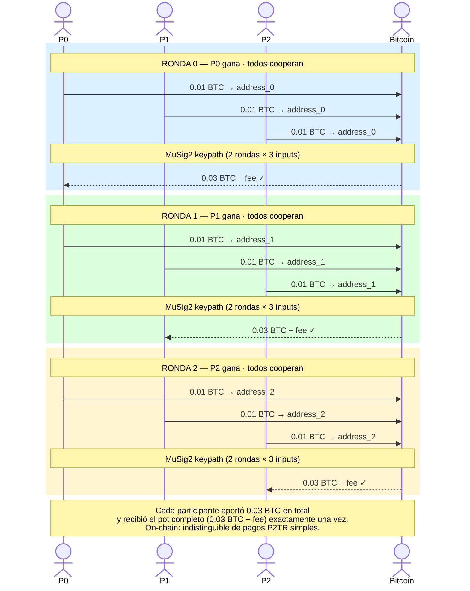
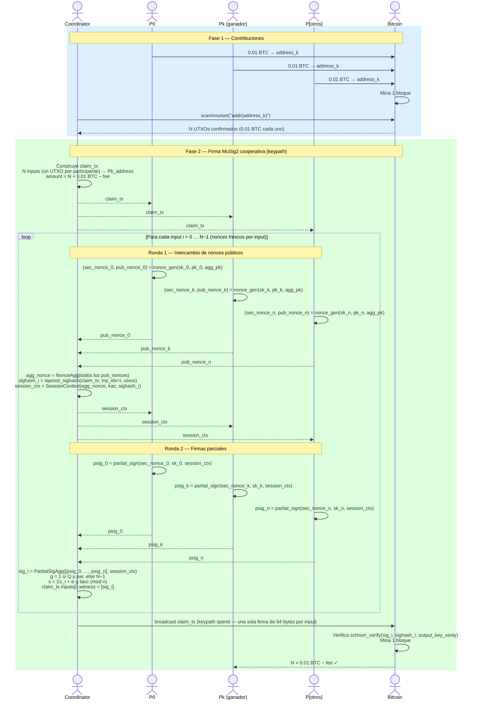
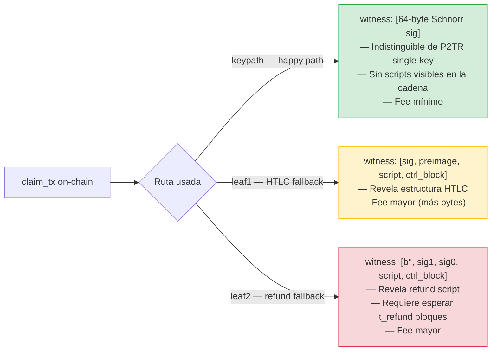
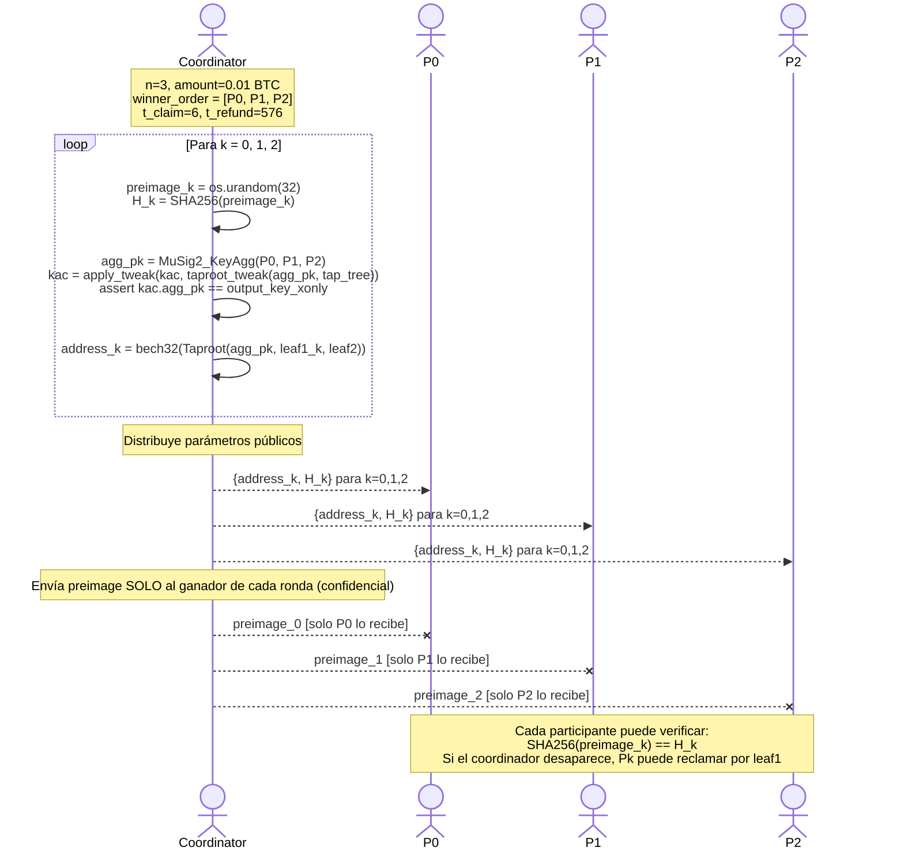

# Tanda-BTC: Happy Path Diagrams — Capa On-Chain

> **Nota:** Estos diagramas describen el camino cooperativo de la capa on-chain (Taproot + MuSig2).
> El demo principal usa Lightning Network — ver [`sequence-diagrams-ln.md`](sequence-diagrams-ln.md).

Diagramas del camino cooperativo completo: 3 rondas, 3 participantes,
todos cooperan en cada ronda. La ruta keypath de MuSig2 se usa en todo momento.
Nunca se activan los fallbacks (HTLC leaf1 ni refund leaf2).

---

## 1. Vista general — Ciclo feliz completo

Tres rondas, tres ganadores, todos cooperan. El coordinador nunca necesita
activar fallbacks. Los fondos se mueven directamente entre participantes.

---

## 2. Ronda (cualquiera) — Flujo cooperativo detallado

El mecanismo es idéntico en las 3 rondas. Solo cambia `address_k` y el ganador `P_k`.

---

## 3. Por qué el happy path es óptimo on-chain

---

## 4. Setup — Preparación de las 3 rondas

El coordinador genera todos los parámetros antes de que comience cualquier ronda.
Los preimages HTLC se envían en privado a cada ganador aunque nunca se usen
en el happy path — sirven de garantía si el coordinador desaparece.

