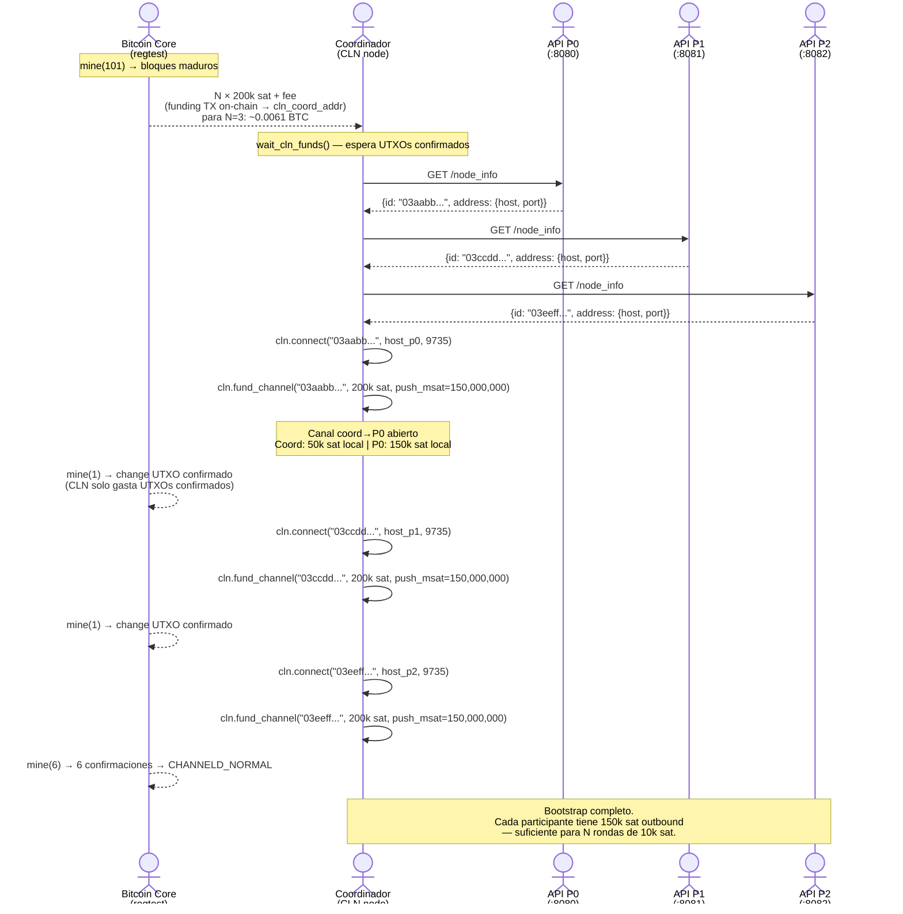
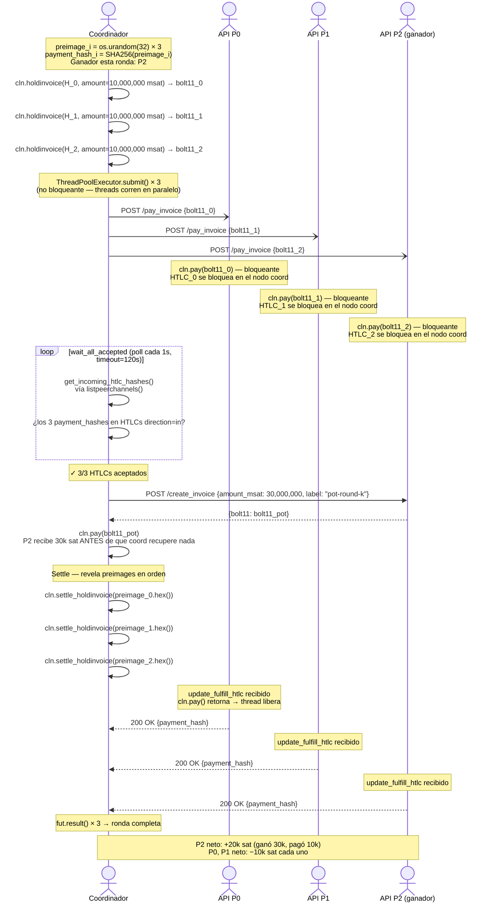
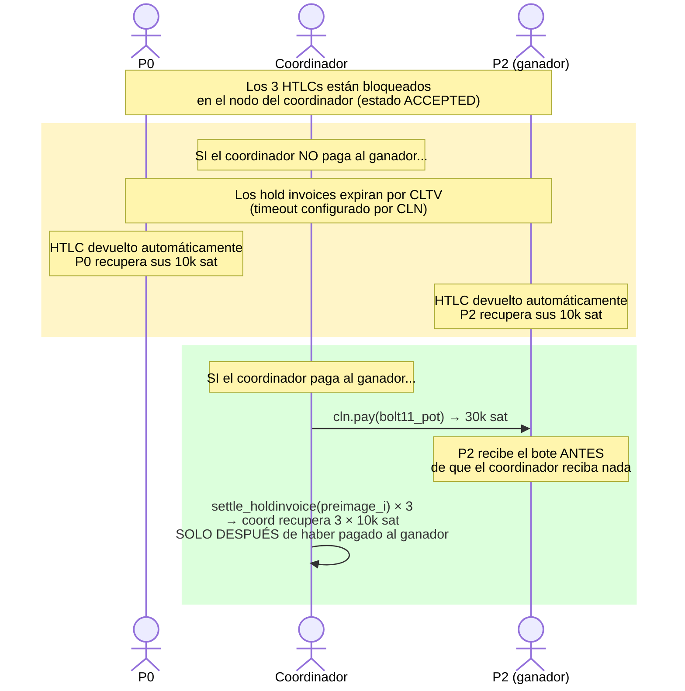
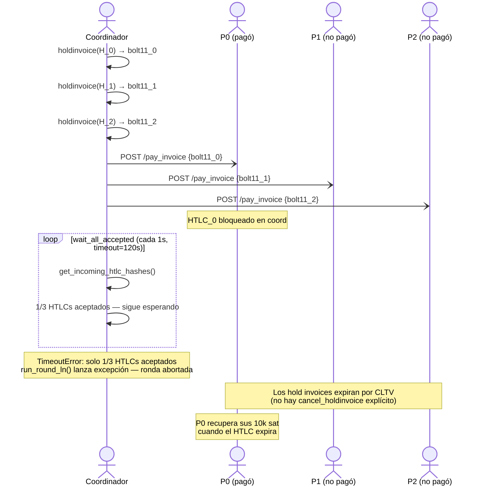
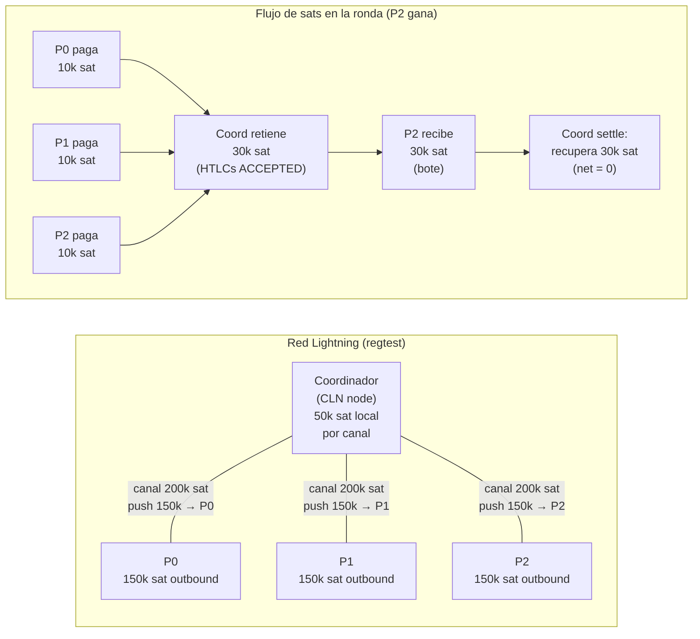

# Tanda-BTC: Diagramas de Secuencia — Lightning Network

Diagramas Mermaid del protocolo tanda sobre Lightning Network con 3 participantes (P0, P1, P2).
El coordinador usa **hold invoices** (BoltzExchange/hold plugin para CLN) para preservar la
garantía trustless.

---

## 1. Bootstrap: topología de canales

El coordinador abre un canal hacia cada participante con push de liquidez.
Ocurre una sola vez antes de las rondas.

---

## 2. Ronda completa: camino feliz (happy path)

El coordinador genera **N preimages distintas** (una por participante) porque CLN rechaza
múltiples hold invoices con el mismo `payment_hash`.

Las llamadas `POST /pay_invoice` se ejecutan en un `ThreadPoolExecutor` — son **no bloqueantes**
para el coordinador, que sigue ejecutando `wait_all_accepted` mientras los threads corren.

---

## 3. Garantía trustless: flujo de HTLCs

Por qué el protocolo es trustless: los fondos de los participantes solo se liberan
**después** de que el coordinador pague al ganador.

**Invariante:** El coordinador solo recupera su liquidez si primero pagó al ganador.
Si no paga, los HTLCs expiran y los participantes recuperan sus sats sin pérdida.

---

## 4. Fallback: timeout de participante

Si no todos los participantes pagan dentro del plazo, `wait_all_accepted` lanza
`TimeoutError` y la ronda aborta. El coordinador **no llama activamente** a
`cancel_holdinvoice` — los hold invoices expiran por CLTV automáticamente.

> **Nota de implementación:** `CLNRpc.cancel_holdinvoice()` existe pero no está conectado
> al flujo actual. Si se necesita cancelación activa e inmediata, llamar a
> `cancel_holdinvoice(payment_hash)` por cada invoice antes de abortar.

---

## 5. Topología de red y flujo de sats por ronda

Vista estática de canales y flujo de valor en una ronda donde P2 gana.

---

## 6. Comparación: on-chain vs Lightning

| | On-chain | Lightning |
|---|---|---|
| Fee por aportación | ~2,000 sat (varias TXs on-chain) | ~0–10 sat (pagos off-chain) |
| Tiempo de liquidación | ~10 min por confirmación | instantáneo |
| Garantía trustless | Taproot HTLC + CSV timelock | Hold invoices + expiración CLTV |
| Privacidad | Direcciones y montos públicos en blockchain | Off-chain; solo apertura/cierre de canal visible |
| Complejidad técnica | Taproot + MuSig2 + BIP-341/342 | CLN + BoltzExchange/hold plugin |
| Requiere nodo LN | No | Sí (CLN con hold plugin) |
| Fallback si coord desaparece | Reclamar via leaf1 (HTLC) o leaf2 (refund CSV) | HTLCs expiran por CLTV → fondos devueltos |

El protocolo LN preserva la garantía trustless del diseño on-chain original:
los participantes solo pierden sus sats si el coordinador cumple su parte.
