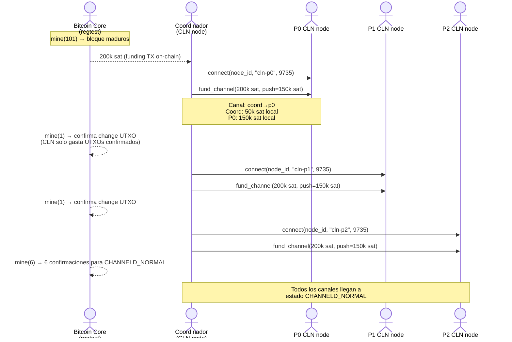
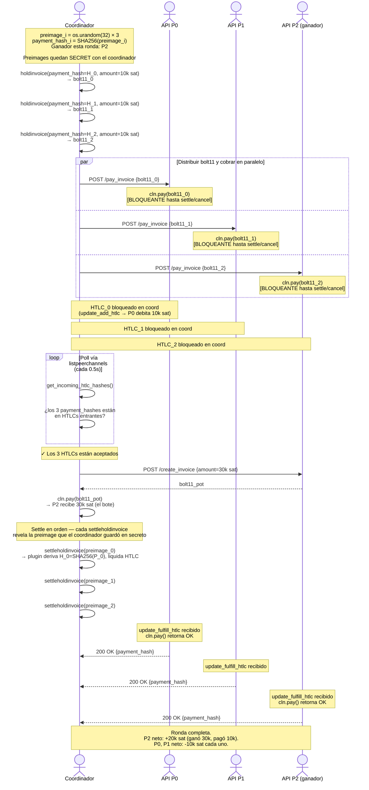
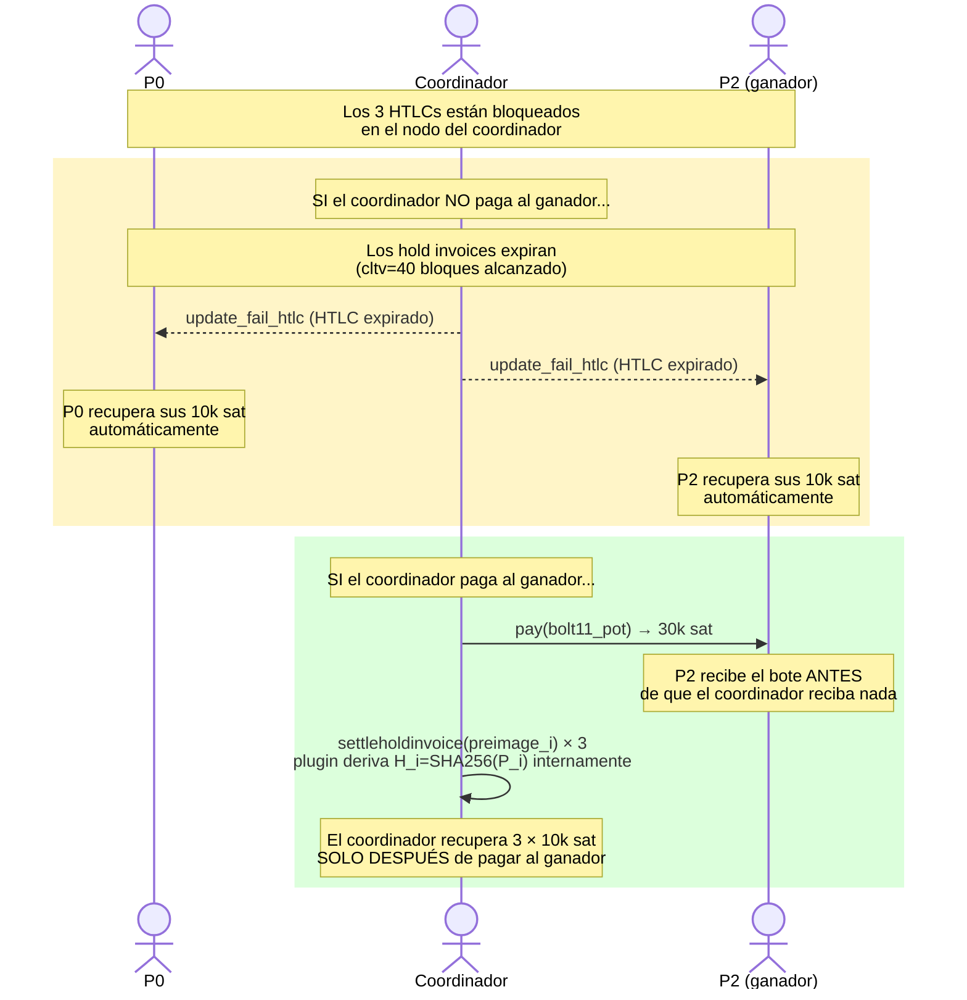
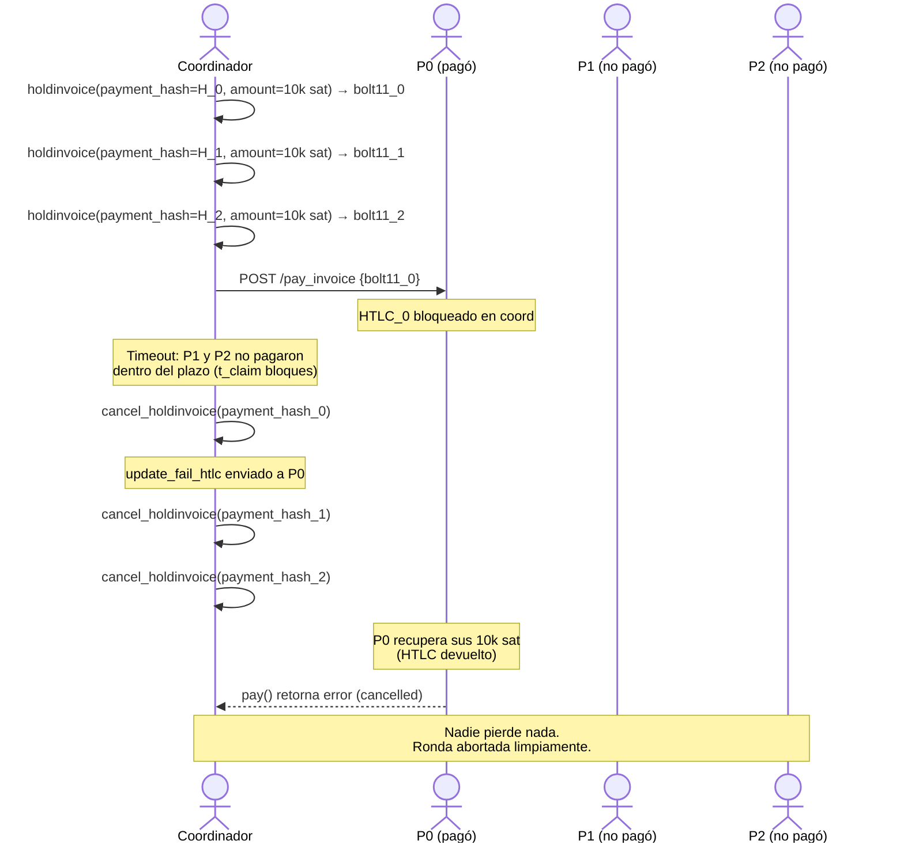
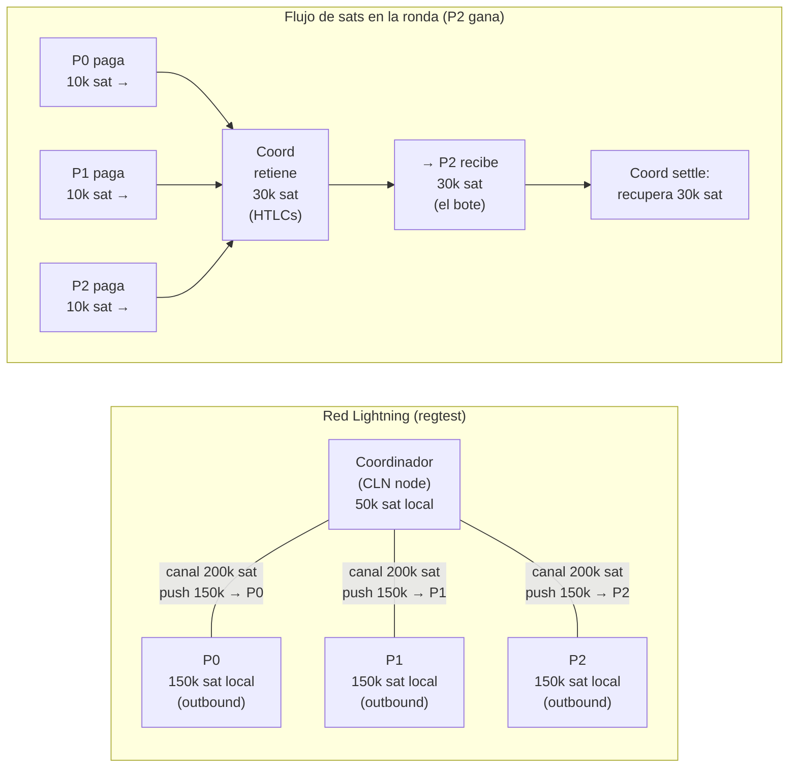

# Tanda-BTC: Diagramas de Secuencia — Lightning Network

Diagramas Mermaid del protocolo tanda sobre Lightning Network con 3 participantes (P0, P1, P2).
El coordinador usa **hold invoices** (HTLCs manuales) de CLN para preservar la garantía trustless.

---

## 1. Bootstrap: topología de canales

El coordinador abre un canal hacia cada participante y hace **push** de sats para darles
capacidad de salida. Esto ocurre una sola vez antes de las rondas.

**Resultado:** Cada participante tiene 150k sat de capacidad de salida hacia el coordinador
— suficiente para pagar N rondas de 10k sat cada una.

---

## 2. Ronda completa: camino feliz (happy path)

El coordinador usa **N preimages distintas** (una por participante) porque CLN rechaza
múltiples hold invoices con el mismo `payment_hash`.

---

## 3. Garantía trustless: flujo de HTLCs

Este diagrama muestra por qué el protocolo es trustless: los fondos de los participantes
solo se liberan **después** de que el coordinador paga al ganador.

**Invariante:** El coordinador solo recupera su liquidez si primero pagó al ganador.
Si no paga, los HTLCs expiran y los participantes recuperan sus sats sin pérdida.

---

## 4. Fallback: cancelación antes del pago

Si el coordinador detecta que no todos los participantes pagaron a tiempo,
cancela todos los hold invoices.

---

## 5. Topología de red y flujo de sats por ronda

Vista estática de canales y flujo de valor en una ronda donde P2 gana.

---

## 6. Comparación: on-chain vs Lightning

| | On-chain | Lightning |
|---|---|---|
| Fee por aportación | ~2,000 sat (20% de 10k sat) | ~0–10 sat (<0.1%) |
| Tiempo de confirmación | ~10 min por bloque | instantáneo |
| Garantía trustless | Taproot HTLC + CSV | Hold invoices + expiración CLTV |
| Privacidad | Pública en blockchain | Off-chain, solo canal visible |
| Complejidad técnica | Taproot + MuSig2 | CLN + holdinvoice plugin |
| Requiere nodo LN | No | Sí (CLN con holdinvoice plugin) |

El protocolo LN preserva la garantía trustless del diseño on-chain original:
los participantes solo pierden sus sats si el coordinador cumple su parte.
