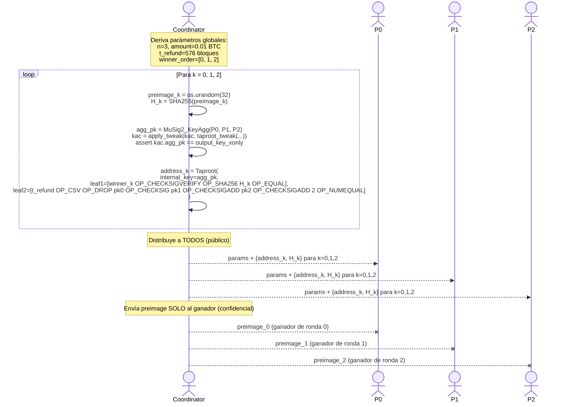
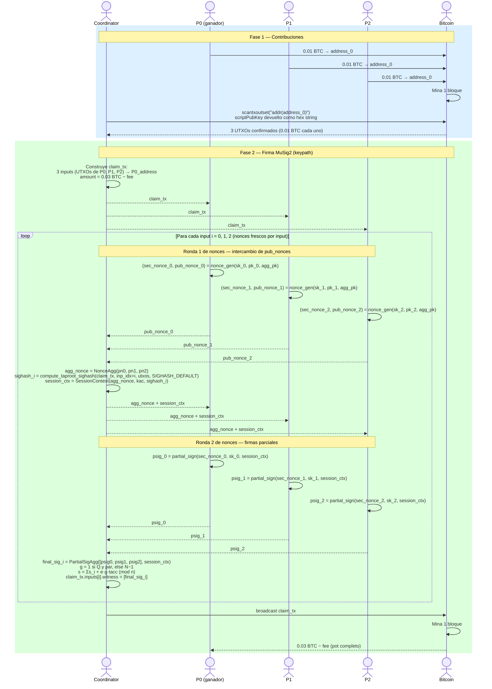
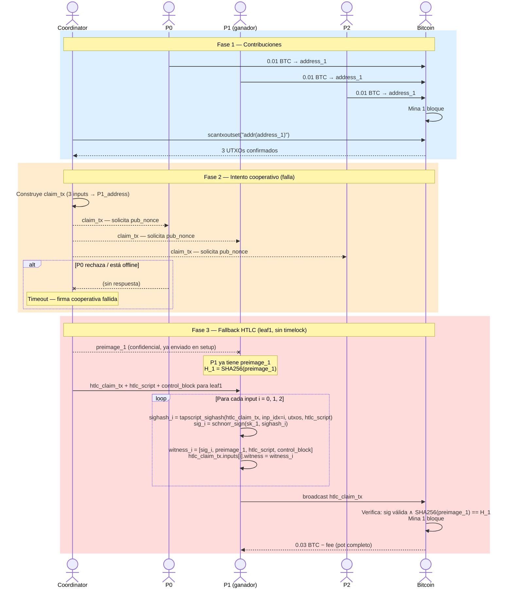
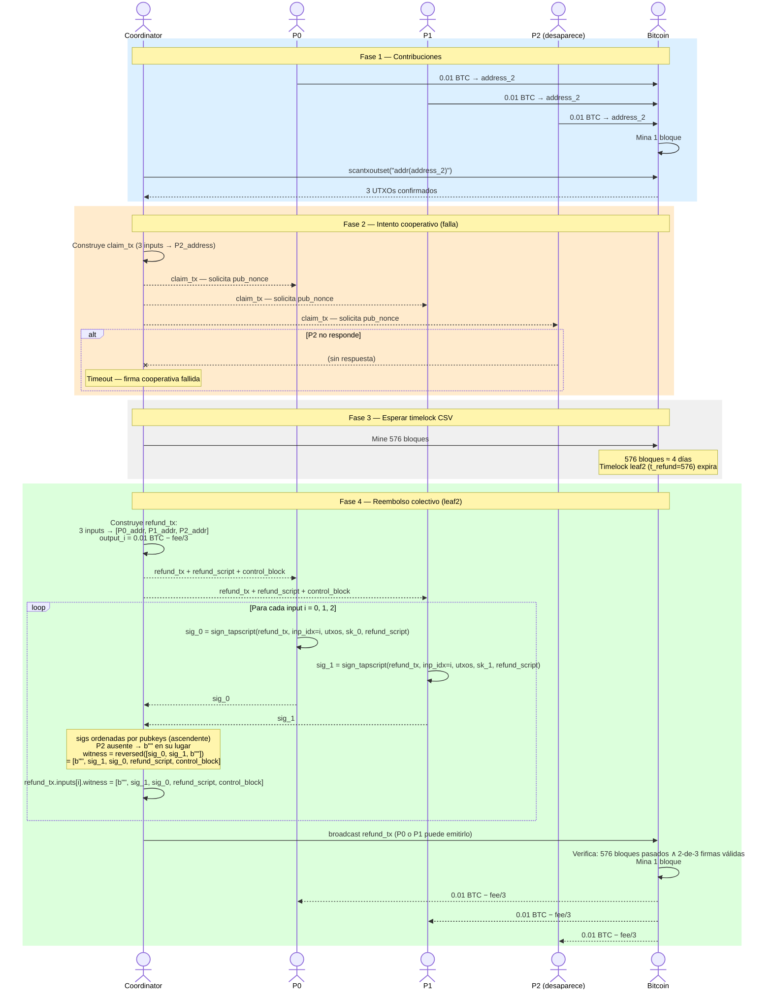
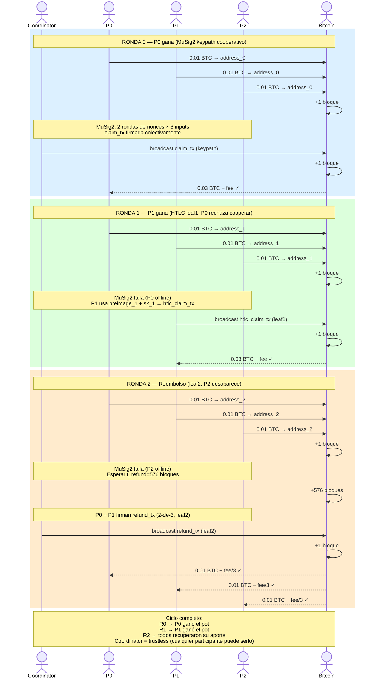

# Tanda-BTC: Sequence Diagrams — Capa On-Chain

> **Nota:** Estos diagramas describen la capa on-chain del protocolo (Taproot + MuSig2 + HTLCs).
> El demo principal usa Lightning Network — ver [`sequence-diagrams-ln.md`](sequence-diagrams-ln.md).

Mermaid sequence diagrams for the full tanda protocol with 3 participants (P0, P1, P2).

---

## 1. Configuración inicial (Setup)

---

## 2. Ronda 0 — Cobro cooperativo (MuSig2 keypath)

P0 es el ganador. Todos cooperan. La ruta keypath de MuSig2 se usa para gastar.

---

## 3. Ronda 1 — Fallback HTLC (leaf1)

P1 es el ganador. P0 rechaza cooperar. Se usa la hoja HTLC (leaf1).

---

## 4. Ronda 2 — Reembolso colectivo (leaf2)

P2 es el ganador designado pero desaparece. P0 y P1 recuperan sus fondos tras el timelock CSV.

---

## 5. Vista general — Ciclo completo

Tres rondas, tres ganadores. Cada participante recibe el pot exactamente una vez.

